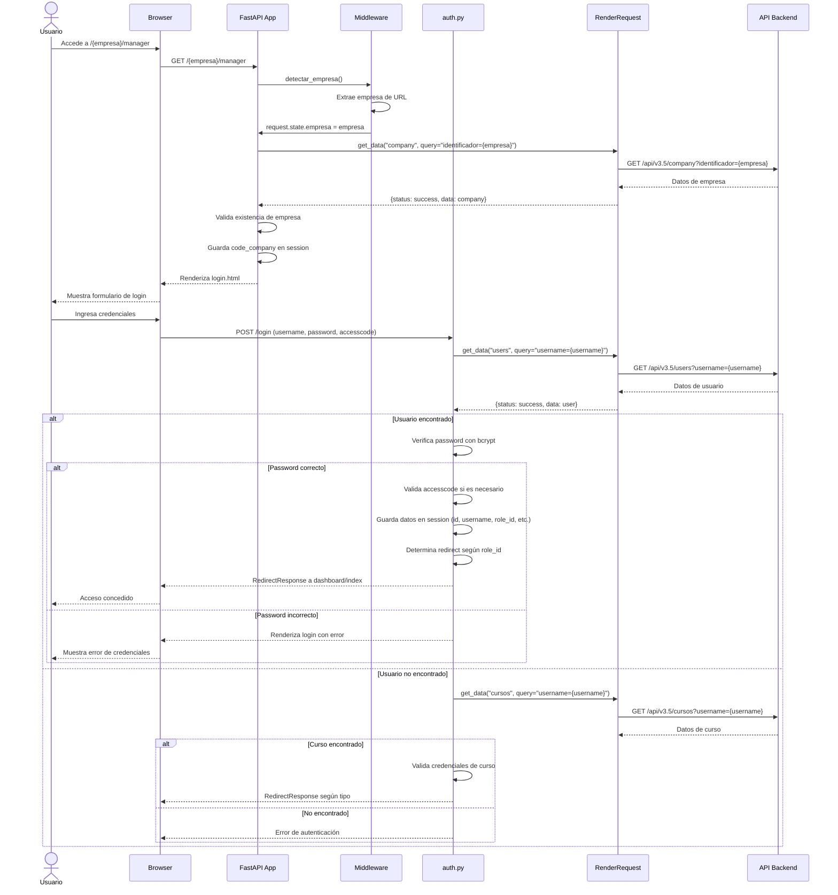
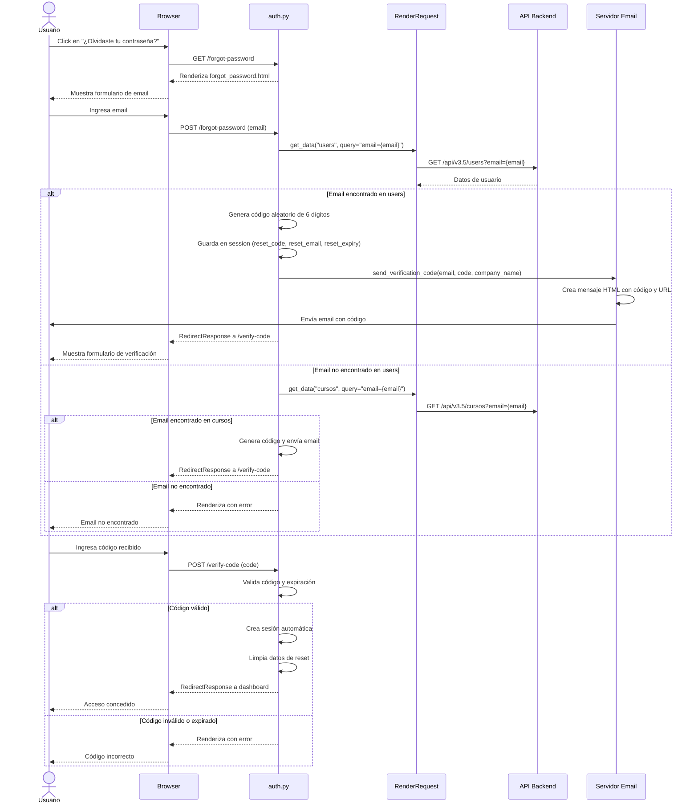
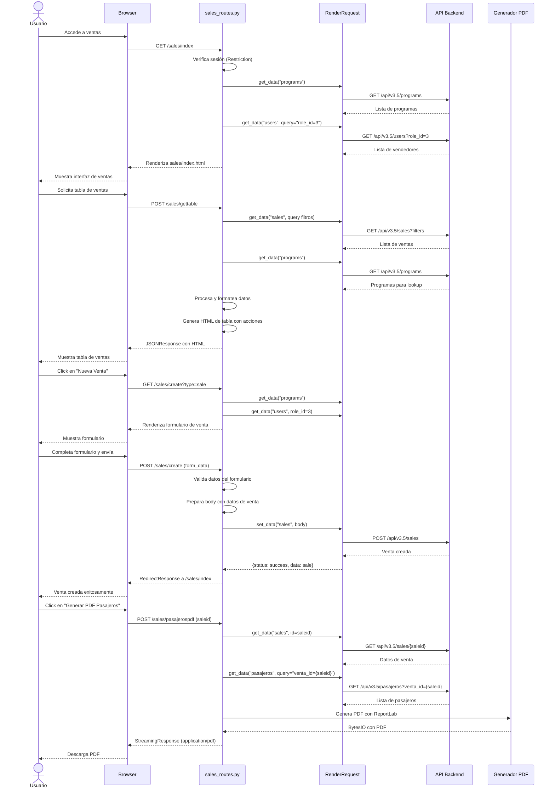
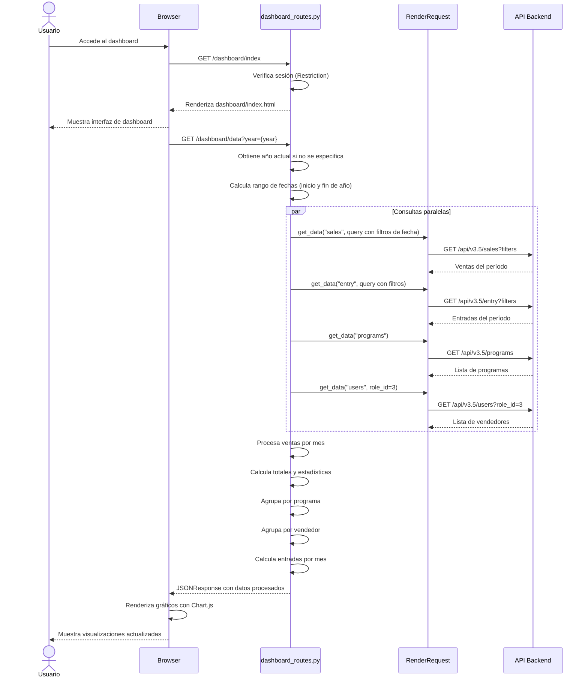
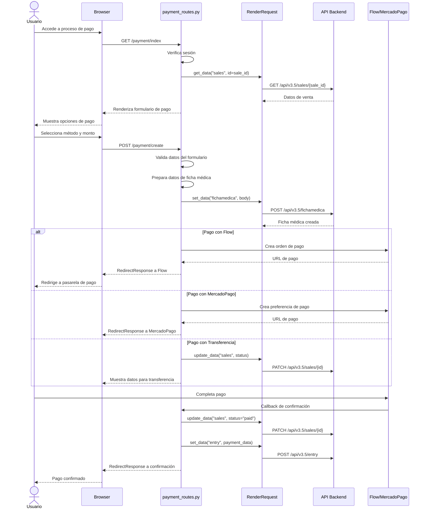
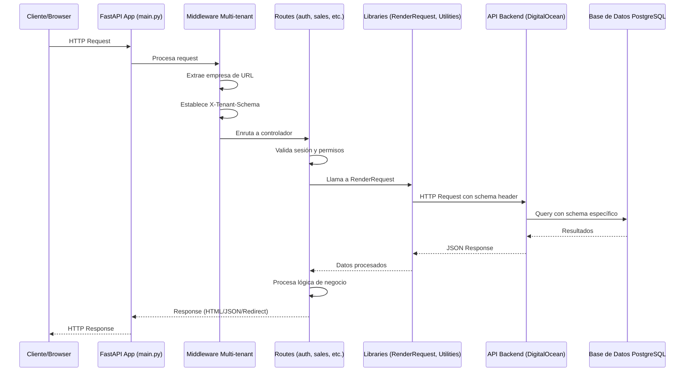

# Diagrama de Secuencia - TourManager

Este documento contiene los diagramas de secuencia de los flujos principales del sistema TourManager.

## 1. Flujo de Autenticación y Login

## 2. Flujo de Recuperación de Contraseña

## 3. Flujo de Gestión de Ventas

## 4. Flujo de Dashboard y Visualización

## 5. Flujo de Proceso de Pago

## 6. Arquitectura General del Sistema

## Componentes Principales

### 1. **main.py**
- Punto de entrada de la aplicación
- Configura FastAPI y middleware
- Gestiona multi-tenancy por URL (/{empresa}/manager)
- Incluye todos los routers dinámicamente

### 2. **Middleware**
- `detectar_empresa()`: Extrae identificador de empresa de la URL
- Valida existencia de empresa en base de datos
- Establece contexto de empresa en request.state

### 3. **Routes**
- **auth.py**: Autenticación, login, logout, recuperación de contraseña
- **sales_routes.py**: Gestión de ventas y cotizaciones
- **dashboard_routes.py**: Visualización de métricas y estadísticas
- **payment_routes.py**: Proceso de pago y fichas médicas
- **programs_routes.py**: Gestión de programas de viaje
- **users_routes.py**: Gestión de usuarios
- Y más...

### 4. **Libraries**
- **RenderRequest**: Cliente HTTP para comunicación con API backend
- **Restriction**: Validación de sesión y permisos
- **Utilities**: Funciones auxiliares
- **MailUtil**: Envío de correos electrónicos

### 5. **API Backend**
- Endpoint: https://stingray-app-trnzb.ondigitalocean.app/api/v3.5
- Soporta multi-tenancy mediante header `X-Tenant-Schema`
- Operaciones CRUD: GET, POST, PATCH, DELETE

## Flujos de Datos

### Multi-tenancy
1. URL: `/{empresa}/manager/*`
2. Middleware extrae `{empresa}`
3. Consulta datos de empresa en schema `global`
4. Todas las operaciones subsecuentes usan schema específico de la empresa

### Autenticación
1. Login con username/password
2. Validación contra tabla `users` o `cursos`
3. Verificación de password con bcrypt
4. Almacenamiento de datos en session
5. Redirección según role_id

### Gestión de Ventas
1. Listado con filtros (fecha, vendedor, programa)
2. Creación de venta con datos de pasajeros
3. Generación de documentos PDF
4. Cambio de estados (cotización → venta → pagada)

### Proceso de Pago
1. Selección de método de pago
2. Creación de ficha médica
3. Integración con pasarelas (Flow, MercadoPago, Transbank)
4. Confirmación y registro de entrada

---

**Generado para**: TourManager Python
**Fecha**: 2025-12-05
**Versión**: 1.0
